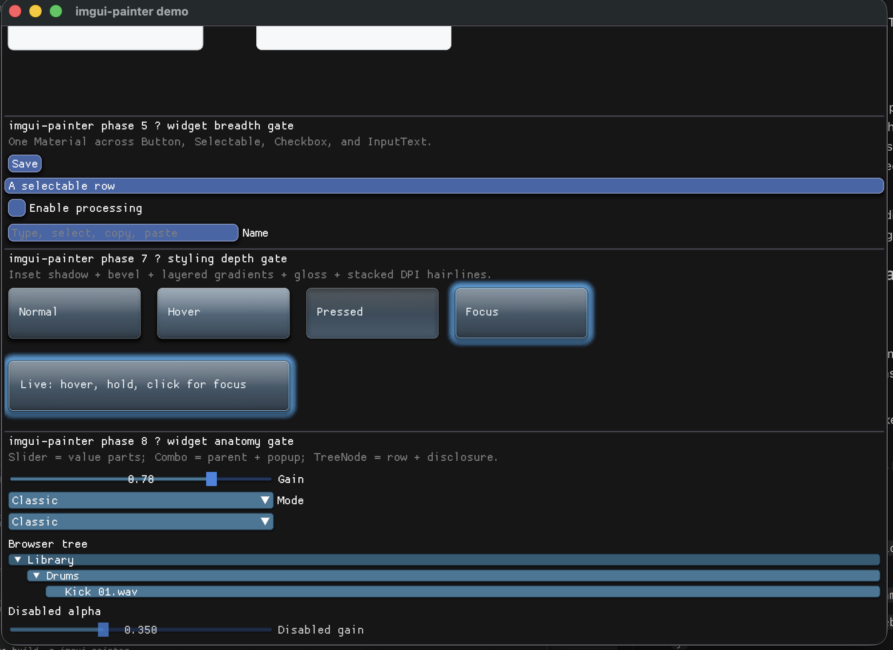

# imgui-painter

A rendering and styling toolkit for Dear ImGui that makes high-quality
visuals as easy as `PushStyleColor`, without replacing ImGui's widget,
layout, or input systems.

**Not** a design system, not Qt, not CSS, not a widget-set replacement.
Closer to a 2D rendering framework specialized for Dear ImGui than to "a
styling helper."

## Status: Phase 9 — Part-specific widget styling

Typed `SliderStyle`/`ComboStyle`/`TreeStyle` give each reconstructed part an
independent appearance, while private per-widget visual states replace the
overloaded active bit. `recipes::Palette` (9 tokens) plus a small recipe family
(`raised_button`, `toolbar_button`, `inset_control`, `selected_row`,
`browser_tree_row`, `parameter_slider`, `combo_field`, `panel`, `inset_panel`)
reproduce the reference desktop chrome. The rack gate exercises hovered,
pressed, adjusting, open, selected, focused, and disabled (style-alpha)
treatments at 1x/1.5x/2x.

Slider, Combo, and TreeNode anatomy is centralized in a private allocation-free
enum. That earns private anatomy resolution, but not a public Resolver: the
geometry is explicitly compatible with Dear ImGui 1.91.9b and the pinned
imgui-rs 0.12 fork revision `7a89260`; no
external custom-widget consumer needs to extend it yet. The evidence and future
part-style requirements live in [Resolver findings](docs/resolver-findings.md).

Phase 7 closes the main rendering-depth gap: inset shadows, band-clipped
solid/gradient overlays, genuinely stacked inset borders, and device-scale
hairlines now compose in painter order. The ImGui-aware `Frame` path samples
`DisplayFramebufferScale` automatically; direct C/C++/`Session` consumers set
their host scale explicitly.

The `painter_demo` now includes an Ableton-inspired chrome recipe reused across
normal, hover, pressed, and focus states. It combines an outer shadow, multi-stop
base gradient, translucent gloss gradient, top bevel hairline, lower shade,
inset shadow, and two or three distinct border outlines without hand-written
draw-list geometry.

The composition remains explicit and ordered rather than introducing a styling
language:

```rust
canvas.rounded_rect(rect, radius);
canvas.add_shadow(&outer_shadow);
canvas.fill_gradient(&surface);
canvas.fill_band_gradient(top, gloss_end, &gloss);
canvas.fill_band_color(top, top + canvas.device_pixel(), highlight);
canvas.add_shadow(&inset_shadow);
canvas.add_border(&outer_border);
canvas.add_border_inset(canvas.device_pixel(), &inner_border);
```

Phase 6 replaces the public item_paint/Decorator pair with
decorate_button/decorate_selectable/decorate_checkbox/decorate_input_text, removing
explicit decorator-selection mismatch from normal use; the raw mechanism is now
private. Note that widget-specific active-slot semantics and chrome-vs-ImGui
ownership are documented on each entry point.

The real Punks redesign added the two host-integration APIs earned by repeated
application pressure. `recipes::apply_imgui_colors(&mut style.colors, &palette)`
maps the compact palette across every stock ImGui color role without adding an
`imgui-rs` dependency. `decorate_selectable(frame, material, selected, widget)`
accepts persistent selection explicitly: pressed interaction outranks selection,
then hover, then base. Decorators preserve the submitted widget as ImGui's last
item, including its ID, bounds, hover, and active queries; this is tested as a
public compatibility contract so tooltips, context menus, and drag/drop may be
attached immediately after a decorated call.

The core, Rust adapter, tests, benchmarks, and examples live under this
directory and build independently from any host application. The crate is
still unpublished while its API develops.

Phase 1 (design doc §12 step 1 — the go/no-go gate for everything else) is
done: `Painter` only, `rounded_rect` + `fill_color` / `fill_gradient`
(linear, radial) / `add_shadow` (stackable) / `add_border` (with hairline
alpha compensation), validated by the three-looks visual gate below.

Phase 2 hardened that same low-level layer before moving up the design
doc's phase list: adaptive (error-bounded) rounded-rect tessellation,
Angular and Diamond gradients, benchmarks against equivalent hand-written
tessellation (see the [comparison table](#comparison-imgui-painter-vs-handwritten-imdrawlist)
below), and a header-only C++ fluent wrapper (`include/imgui_painter.h`)
alongside the Rust binding.

Phase 3 introduced the long-lived `Painter` → per-frame `Frame` → per-draw-list
`Canvas` ownership chain used by host applications.

Phase 4A **prototyped the item-paint bracket (§5)** — the mechanism that
restyles a *stock* `ImGui::Button()`/`Selectable()` with no wrapper widget:
a 3-channel draw-list split (Background → Widget → Overlay), the widget's own
frame colors (all interaction states) pushed transparent, and the decoration
painted behind the widget.

Phase 4B graduates that prototype into the ImGui-aware Rust adapter API:
`Material` holds the minimal shared radius/fill/border/shadow inputs,
`Decorator` maps Button and Selectable to their ImGui color slots, and
`item_paint` preserves the stock widget's layout, input, text, and return value.
The ImGui-free core remains unchanged.

Phase 5 adds Checkbox and single-line InputText without expanding `Material`.
Their chrome rectangles are captured separately from the complete ImGui item so
Checkbox paint excludes its label and InputText paint excludes its visible
label. The resulting anatomy, state, type-safety, and ImGui-version coupling
evidence is recorded in [Resolver findings](docs/resolver-findings.md).

Still deferred after Phase 9: a public Resolver, `CheckboxStyle`, focus-ring
styling, disabled-specific appearance, icons, themes, `PushMaterial`, and
typography.

Run the visual gate:

```
cargo run -p imgui-painter --example painter_demo
```

It renders three hand-built looks (a macOS-style panel, a Fluent-style button,
a GitHub-style button), stock Button/Selectable/Checkbox/InputText widgets, the
Phase 7 layered-chrome state row, the Phase 8 Slider/Combo/TreeNode gallery, and
the Phase 9 Ableton-inspired recipe rack. A human must verify the multipart
widgets and rack at `IMGUI_PAINTER_DEMO_UI_SCALE=1.0/1.5/2.0`, and confirm that
inner shadows stay clipped, bevel/gloss bands follow rounded corners, stacked
borders remain distinct, pressed chrome reads inset, focus reads as focus
rather than hover, and hairlines stay crisp at the current display scale.
Slider dragging/keyboard editing, Combo popup selection and stock
Button/InputText chrome inside the popup, and TreeNode disclosure/navigation
must remain stock behavior. Automated tests cover mesh geometry, lifecycle
cleanup, and composition invariants, not final rasterized appearance.

The example accepts a demo-only logical UI scale for compatibility screenshots.
Framebuffer scale remains the real host value so renderer/scissor coordinates
stay valid and physical-pixel behavior is tested independently:



```text
IMGUI_PAINTER_DEMO_UI_SCALE=1.0 cargo run -p imgui-painter --example painter_demo
IMGUI_PAINTER_DEMO_UI_SCALE=1.5 cargo run -p imgui-painter --example painter_demo
IMGUI_PAINTER_DEMO_UI_SCALE=2.0 cargo run -p imgui-painter --example painter_demo
```

## Dependency bump checklist

On any imgui/imgui-sys source or version bump, rerun the visual gate at 1×,
1.5×, and 2×. The authoritative compatibility target is Dear ImGui 1.91.9b
through imgui-rs fork revision `7a89260c79ad1f9d4bfe81d6ca1b76ad38a6b3e3`.
Re-verify the original four widgets, Slider frame/fill/grab alignment and
temporary input, visible/hidden-label Combo popup lifecycle, non-leaf/leaf
TreeNode disclosure alignment, disabled alpha, and physical-pixel hairlines.
Refresh the Slider formula tests, screenshots, `ANATOMY_COMPATIBILITY`, and
[`VERIFIED_IMGUI_SYS`](VERIFIED_IMGUI_SYS). Reconstructed part geometry is not
a stable upstream contract and can silently desynchronize on a source-compatible
bump.

This checklist is CI-enforced, not advisory: the independent-build job resolves
imgui-sys fresh (no lockfile) and fails whenever the resolved version differs
from [`VERIFIED_IMGUI_SYS`](VERIFIED_IMGUI_SYS) — the version a human last ran
this checklist against. Upstream point releases trip it too, by design. To
acknowledge a bump: run the checklist above, then update that file.

## Comparison: imgui-painter vs. handwritten ImDrawList

`bindings/rust/benches/tessellation.rs` benchmarks `Session`-driven mesh
generation against `benches/handwritten.rs`, a from-scratch pure-Rust
tessellation with no FFI and no generic gradient dispatch — both producing
the same macOS-panel look (rounded rect + soft shadow + linear gradient
fill + 1px border) from `painter_demo.rs`. Run it yourself with
`cargo bench -p imgui-painter`; one measured run on this machine:

| | imgui-painter (`Session`) | handwritten `ImDrawList`-style Rust |
|---|---|---|
| Source lines for this one look | ~42 ([`draw_macos_panel_painted`](bindings/rust/examples/painter_demo/main.rs)) | ~213 ([`benches/handwritten.rs`](bindings/rust/benches/handwritten.rs)) |
| Tessellation | adaptive, error-bounded (`CornerSegments`) | fixed 8 segments/corner |
| Shadow rings | one `add_shadow` call | hand-rolled ring loop + falloff math |
| Gradient | generic 4-mode `GradientT` dispatch | inlined 2-stop linear lerp only |
| Border ordering | handled by call order | handled by call order (same shape, rewritten) |
| Mesh size (this look) | 433 vtx / 1260 idx | 553 vtx / 1620 idx |
| Time per mesh | ~6.96 µs (6.91–7.02 µs) | ~8.78 µs (8.56–9.05 µs) |

The adaptive tessellation formula picks fewer segments than a fixed
per-corner count wherever the shape's actual radii don't need more —
smaller mesh *and* less time to generate it, even after crossing the
Rust↔C++ FFI boundary the handwritten version doesn't have to. This isn't a
universal result (a shape with large radii and a fixed-count implementation
tuned lower would tessellate faster and coarser); it's this one look, which
is also the one the visual gate already validated as looking correct.

## Architecture

```
imgui-painter core     (C++, compiled via cc; ZERO Dear ImGui / cimgui
                        dependency — pure math in, a generic vertex/index
                        mesh out)
        ↑ C API (capi/imgui_painter_c.h)
imgui-painter Rust adapter  (bindings/rust — copies the core's mesh into a
                        real ImDrawList through imgui-sys's own public
                        PrimReserve/PrimWriteVtx/PrimWriteIdx calls, never
                        by touching ImDrawList's internal buffers directly)
        ↑
host app (via imgui-rs/imgui-sys)
```

The core never links against Dear ImGui or cimgui — a host's adapter rides
whichever ImGui build the host app already linked. Cargo resolves the adapter
and imgui-rs 0.12 to one shared `imgui-sys` build, so there is never a second
ImGui instance or an ABI-layout guess.

This was a deliberate design decision, not the initial one: an earlier plan
had the core write directly into `ImDrawList`'s vertex/index buffers to
avoid any ImGui dependency at all. That was rejected because `ImDrawList`'s
public *fields* are stable to read but its *invariants* (write-pointer
bookkeeping, texture/clip-rect stacking, large-mesh vertex-offset handling)
are maintained by methods like `PrimReserve`, are not part of any ABI
guarantee, and have changed across Dear ImGui versions. The core/adapter
split gets the same "core has zero ImGui dependency" property without
taking on responsibility for invariants only Dear ImGui itself is entitled
to change.

## Repo layout

```
imgui-painter/
  include/imgui_painter.h   header-only C++ fluent wrapper
                             (Painter(rect).fill(...).shadow(...)
                             .border(...).draw(dl)) over capi/ — a
                             template draw() keeps it ImGui-dependency-free
                             too; see bindings/rust/tests/
                             fluent_header_mock.cpp for its compile-check
  capi/imgui_painter_c.h    the C ABI — every language binding compiles
                             against this
  capi/imgui_painter_c.cpp  ip_version() only; the real implementation
                             lives in src/
  src/painter.cpp           the core: tessellation, gradients, shadows,
                             borders — zero ImGui dependency
  bindings/rust/            the Rust adapter + safe wrapper (this phase's
                             only binding)
  bindings/rust/benches/    Session vs. handwritten-Rust tessellation
                             benchmark (cargo bench -p imgui-painter)
  bindings/rust/tests/      fluent_header_compiles.rs + the mock .cpp it
                             drives — proves include/imgui_painter.h
                             compiles standalone
  bindings/rust/examples/   basic usage + the painter_demo development sandbox
  docs/resolver-findings.md Phase 5 evidence and Phase 6 requirements
  README.md                 this file
```

## Building

`bindings/rust`'s `build.rs` compiles the C++ core with the [`cc`](https://docs.rs/cc)
crate — the same mechanism `imgui-sys` itself uses to compile cimgui. Needs a
C++17 compiler; the supported desktop platforms ship one
(GCC/Clang on Linux/macOS via `apt`/Xcode CLT, MSVC on Windows via the
Visual Studio Build Tools). `cargo test` also compiles
`include/imgui_painter.h` against a mock draw-list
(`bindings/rust/tests/fluent_header_compiles.rs`) to catch header rot;
`cargo bench -p imgui-painter` is separate (not part of the default test
run) and produces the numbers in the [comparison table](#comparison-imgui-painter-vs-handwritten-imdrawlist)
above.

To prove the tree is self-contained, copy `imgui-painter/` anywhere outside a
host workspace and run:

```
cd imgui-painter/bindings/rust
cargo build --examples
cargo test
```

The repository CI performs exactly this independent-copy check.

## Future repository split

Once later phases (Resolver, Recipe, themes, component library) are built
out here, this directory becomes its own repository: `include/`, `capi/`,
`src/` move as-is, `bindings/rust` becomes a published crate, and
`bindings/{c,zig,csharp,python}` land as separate binding crates against
the same `capi/imgui_painter_c.h` surface.
